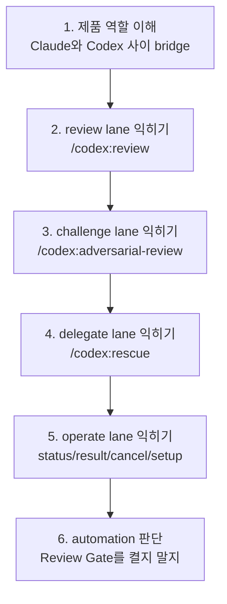

# codex-plugin-cc 학습 경로

이 문서는 Codex Plugin for Claude Code를 **명령어 목록**이 아니라 **lane 기반 워크플로우 도구**로 익히기 위한 학습 순서를 정리한다.

핵심 원칙은 하나다.

> **명령을 외우지 말고, review / challenge / delegate / operate 네 가지 흐름으로 구분해서 배워라.**

---

## 학습 경로 개요



---

## 트랙 1 — 빠른 입문

### 목표

- 이 플러그인이 무엇을 연결하는지 이해
- 가장 자주 쓰는 기본 lane 하나를 바로 실행
- foreground와 background의 차이를 감각적으로 익힘

### 먼저 읽을 문서

1. `README.md`
2. `sections/01-overview.md`
3. `01-usage-scenarios.md`

### 첫 실습

```bash
/codex:review --background
/codex:status
/codex:result
```

### 성공 기준

- review lane의 기본 흐름을 설명할 수 있다
- background 작업을 어떻게 확인하는지 안다

---

## 트랙 2 — 리뷰 중심 사용자

### 목표

- 일반 리뷰와 adversarial 리뷰의 차이를 명확히 구분
- diff 범위와 focus text를 상황에 맞게 쓸 수 있음
- 배포 전 검증 루틴을 스스로 구성할 수 있음

### 먼저 읽을 문서

1. `categories/code-review.md`
2. `01-usage-scenarios.md`
3. `02-glossary.md`

### 추천 순서

#### 1단계 — 일반 리뷰

```bash
/codex:review --wait
/codex:review --base main --background
```

#### 2단계 — challenge 리뷰

```bash
/codex:adversarial-review --base main 인증/롤백 설계가 맞는지 검토해줘
```

### 여기서 꼭 구분할 것

- `review`는 구현 결함을 읽는다
- `adversarial-review`는 접근 방식과 숨은 가정을 흔든다

### 성공 기준

- 두 명령의 차이를 “강도 차이”가 아니라 “관점 차이”로 설명할 수 있다
- 언제 `--base main`이 필요한지 안다

---

## 트랙 3 — 작업 위임 중심 사용자

### 목표

- `/codex:rescue`를 단순 호출이 아니라 위임 lane으로 이해
- `resume` / `fresh`, `model`, `effort`, `background`를 상황에 맞게 조합
- 조사 → 결과 확인 → 후속 적용 흐름을 설계할 수 있음

### 먼저 읽을 문서

1. `categories/task-delegation.md`
2. `01-usage-scenarios.md`
3. `02-glossary.md`

### 추천 실습

```bash
/codex:rescue investigate why the tests started failing
/codex:rescue --background flaky integration test의 원인을 조사해줘
/codex:rescue --resume 위에서 찾은 첫 번째 수정안을 적용해줘
```

### 여기서 먼저 익혀야 할 것

- 작은 follow-up이면 `--resume`
- 다른 접근으로 새로 시도하면 `--fresh`
- 오래 걸리면 `--background`
- 빠른 값싼 탐색이면 `--model spark`
- 깊은 조사면 높은 effort

### 성공 기준

- rescue thread를 이어가는 이유를 설명할 수 있다
- 조사와 수정 적용을 한 lane 안에서 관리할 수 있다

---

## 트랙 4 — 운영/자동화 사용자

### 목표

- 작업 관리 명령과 hook 기반 automation을 이해
- Review Gate를 언제 켜고 끌지 판단 가능
- 세션 운영 관점에서 plugin을 다룰 수 있음

### 먼저 읽을 문서

1. `categories/operations.md`
2. `categories/code-review.md`의 Review Gate 섹션
3. `02-glossary.md`

### 중요 포인트

- `/codex:setup`은 단순 설치 확인이 아니다
- `status/result/cancel`은 background lane의 관제 도구다
- Review Gate는 강력하지만 비용/시간 오버헤드가 있다

### 성공 기준

- 중요 세션에서만 Review Gate를 켜야 하는 이유를 설명할 수 있다
- background 작업을 운영하는 흐름을 이해한다

---

## 가장 추천하는 읽기 순서

1. `sections/01-overview.md`
2. `README.md`
3. `01-usage-scenarios.md`
4. `categories/code-review.md`
5. `categories/task-delegation.md`
6. `categories/operations.md`
7. `02-glossary.md`

---

## 자주 틀리는 학습 순서

### 잘못된 순서 1

`review와 adversarial-review를 같은 명령으로 보기`

왜 틀리나:
- 하나는 결함 검토, 다른 하나는 설계 도전이다

### 잘못된 순서 2

`rescue를 그냥 긴 Codex 실행이라고 보기`

왜 틀리나:
- rescue는 thread / resume / model / effort / background 관리가 묶인 위임 lane이다

### 잘못된 순서 3

`Review Gate를 기본값처럼 켜기`

왜 틀리나:
- 안전망이지만 항상 이득인 건 아니다
- 루프/사용량/속도 오버헤드가 있다

---

## 최종 체크리스트

- [ ] review lane을 돌려봤다
- [ ] adversarial-review의 쓰임새를 안다
- [ ] rescue에서 resume/fresh 차이를 안다
- [ ] status/result/cancel 흐름을 안다
- [ ] Review Gate를 언제 켤지 판단할 수 있다
