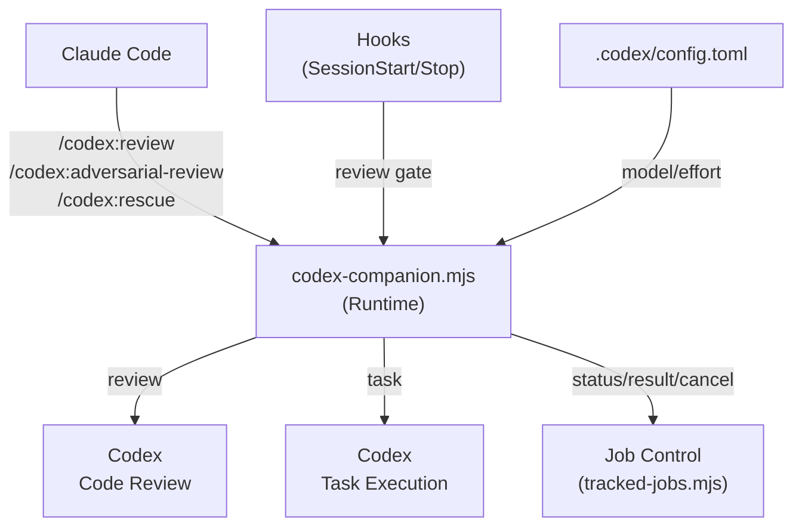

# Codex Plugin for Claude Code -- 실무 사용 가이드

**Claude Code 사용자를 위한 OpenAI Codex 플러그인 실전 활용서**

---

## 이 가이드는 무엇인가?

이 가이드는 [codex-plugin-cc](https://github.com/openai/codex-plugin-cc) 플러그인의 **실무 사용 가이드**입니다. 원본 README가 "이 플러그인이 무엇을 하는가"를 설명한다면, 이 가이드는 "실무에서 어떻게 사용하는가"를 다룹니다.

Codex 플러그인은 Claude Code 안에서 OpenAI Codex를 호출하여 **코드 리뷰**와 **작업 위임**을 수행합니다. 이 가이드는 7개 명령어의 옵션, 실무 시나리오, 설정 방법, 그리고 효과적인 프롬프트 작성법까지 체계적으로 안내합니다.

---

## 대상 독자

- Claude Code를 사용 중이며 Codex CLI를 처음 접하는 개발자
- 원본 README를 읽었지만 실무 적용이 막히는 사용자
- 코드 리뷰 자동화와 작업 위임을 Claude Code 워크플로우에 통합하고 싶은 팀

---

## 요구사항

| 항목 | 조건 |
|------|------|
| **인증** | ChatGPT subscription (Free 포함) 또는 OpenAI API key |
| **런타임** | Node.js 18.18 이상 |
| **환경** | Claude Code가 설치된 터미널 환경 |

> 사용량은 Codex 사용 한도에 포함됩니다. [요금 정책 확인](https://developers.openai.com/codex/pricing)

---

## 설치

### 1단계: 마켓플레이스 추가 및 플러그인 설치

```bash
/plugin marketplace add openai/codex-plugin-cc
/plugin install codex@openai-codex
/reload-plugins
```

### 2단계: 설치 확인

```bash
/codex:setup
```

Codex CLI가 없으면 설치를 제안합니다. 직접 설치하려면:

```bash
npm install -g @openai/codex
```

### 3단계: 인증 (최초 1회)

Codex가 설치되었지만 로그인되지 않은 경우:

```bash
!codex login
```

설치 후 `/agents`에서 `codex:codex-rescue` 서브에이전트가 보이면 정상입니다.

---

## 명령어 요약

| 명령어 | 설명 | 카테고리 |
|--------|------|----------|
| `/codex:review` | git 상태 기반 코드 리뷰 실행 | [코드 리뷰](categories/code-review.md) |
| `/codex:adversarial-review` | 설계 판단에 도전하는 심층 리뷰 실행 | [코드 리뷰](categories/code-review.md) |
| `/codex:rescue` | 조사/수정 작업을 Codex에 위임 | [작업 위임](categories/task-delegation.md) |
| `/codex:status` | 실행 중/완료된 Codex 작업 상태 확인 | [운영](categories/operations.md) |
| `/codex:result` | 완료된 작업의 최종 결과 조회 | [운영](categories/operations.md) |
| `/codex:cancel` | 실행 중인 백그라운드 작업 취소 | [운영](categories/operations.md) |
| `/codex:setup` | Codex CLI 상태 확인 및 Review Gate 설정 | [운영](categories/operations.md) |

---

## 빠른 시작: 5분 안에 첫 리뷰

코드를 변경한 상태에서 다음을 실행합니다:

```bash
# 1. 현재 변경사항을 Codex에게 리뷰 요청 (백그라운드)
/codex:review --background

# 2. 진행 상태 확인
/codex:status

# 3. 완료 후 결과 읽기
/codex:result
```

이것이 가장 기본적인 워크플로우입니다. 더 다양한 실무 시나리오는 [01-usage-scenarios.md](01-usage-scenarios.md)를 참고하세요.

---

## 전체 아키텍처



**구성 요소 설명**:

- **Claude Code**: 사용자가 슬래시 명령어를 입력하는 진입점
- **codex-companion.mjs**: 모든 명령어를 처리하는 플러그인 런타임 코어. review, task, status, result, cancel 등 하위 명령을 라우팅
- **Codex Code Review**: `review` 및 `adversarial-review` 명령의 실행 엔진
- **Codex Task Execution**: `rescue` 명령으로 위임된 작업의 실행 엔진
- **Job Control (tracked-jobs.mjs)**: 백그라운드 작업의 상태 추적 및 관리
- **Hooks**: SessionStart/SessionEnd/Stop 훅을 통한 라이프사이클 관리 및 Review Gate 트리거
- **config.toml**: 모델, effort 수준 등 런타임 설정

---

## 카테고리별 상세 문서

| 카테고리 | 포함 명령어 | 문서 |
|----------|------------|------|
| **코드 리뷰** | `review`, `adversarial-review`, Review Gate | [categories/code-review.md](categories/code-review.md) |
| **작업 위임** | `rescue`, `codex-rescue` 에이전트, 모델/effort 설정 | [categories/task-delegation.md](categories/task-delegation.md) |
| **운영** | `setup`, `status`, `result`, `cancel`, config.toml, 훅 시스템 | [categories/operations.md](categories/operations.md) |

---

## 설정 요약

플러그인은 Codex CLI의 표준 설정 파일을 그대로 사용합니다.

| 위치 | 용도 |
|------|------|
| `~/.codex/config.toml` | 사용자 전역 설정 |
| `.codex/config.toml` | 프로젝트별 설정 (우선 적용) |

```toml
# 프로젝트별 설정 예시: .codex/config.toml
model = "gpt-5.4-mini"
model_reasoning_effort = "high"
```

자세한 설정 옵션은 [categories/operations.md](categories/operations.md)를 참고하세요.

---

## 추가 자료

- [실무 시나리오 가이드](01-usage-scenarios.md) -- 5개 실전 워크플로우
- [용어 사전](02-glossary.md) -- 플러그인 고유 개념 정의
- [원본 플러그인 저장소](https://github.com/openai/codex-plugin-cc)
- [Codex CLI 문서](https://developers.openai.com/codex/cli/)
- [Codex 설정 레퍼런스](https://developers.openai.com/codex/config-reference)

---

## 라이선스

Apache-2.0 -- 원본 플러그인과 동일한 라이선스를 따릅니다.
