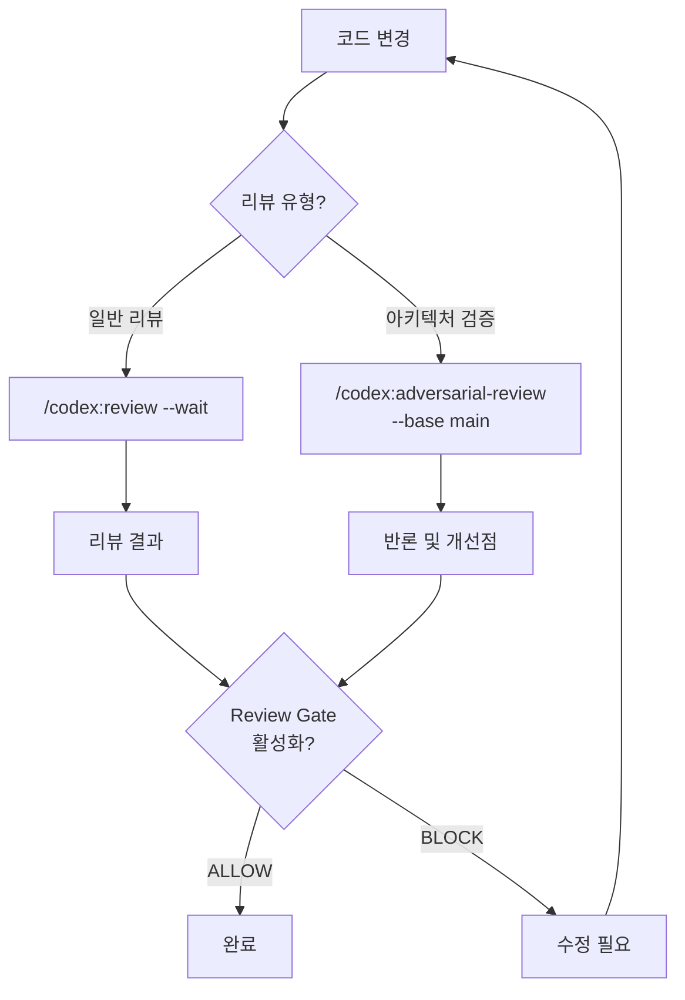

# 코드 리뷰

이 문서는 Codex 플러그인의 코드 리뷰 기능을 상세히 다룹니다: `/codex:review`, `/codex:adversarial-review`, 그리고 Review Gate.

---

## 코드 리뷰 워크플로우



---

## `/codex:review`

git 상태를 기반으로 Codex 코드 리뷰를 실행합니다. 읽기 전용이며 코드를 수정하지 않습니다.

### 문법

```bash
/codex:review [--wait|--background] [--base <ref>] [--scope auto|working-tree|branch]
```

### 옵션

| 옵션 | 설명 |
|------|------|
| `--wait` | 리뷰 완료까지 대기 (foreground 실행) |
| `--background` | 백그라운드에서 실행하고 즉시 반환 |
| `--base <ref>` | 지정한 ref(예: `main`)와의 브랜치 diff를 리뷰 |
| `--scope auto\|working-tree\|branch` | 리뷰 대상 범위 지정. `auto`는 자동 판단 |

> `--wait`과 `--background`를 둘 다 지정하지 않으면 변경 크기를 분석한 뒤 추천합니다. 1-2개 파일이면 대기, 그 외에는 백그라운드를 권장합니다.

### 동작 원리

1. 플러그인이 `git diff`와 `git status`를 분석하여 리뷰 대상을 결정
2. `codex-companion.mjs review`를 호출하여 Codex에 리뷰 요청
3. Codex가 diff를 분석하고 결과를 반환
4. 결과가 그대로 출력됨 (요약이나 수정 없음)

### 실전 예시

```bash
# 워킹트리 변경사항 리뷰 (대기)
/codex:review --wait

# main 브랜치 대비 전체 변경 리뷰 (백그라운드)
/codex:review --base main --background

# 범위를 자동 판단하여 리뷰
/codex:review
```

### 팁

- 멀티파일 변경은 시간이 걸리므로 `--background` 사용을 권장합니다
- 백그라운드 실행 후 `/codex:status`로 진행 확인, `/codex:result`로 결과 조회
- 커스텀 리뷰 지침이나 집중 영역 지정이 필요하면 `/codex:adversarial-review`를 사용하세요
- staged/unstaged만 따로 리뷰하는 기능은 지원하지 않습니다

---

## `/codex:adversarial-review`

구현 접근 방식과 설계 선택에 도전하는 심층 리뷰를 실행합니다. 일반 `review`보다 엄격한 검사가 아니라, 관점 자체가 다릅니다.

### 문법

```bash
/codex:adversarial-review [--wait|--background] [--base <ref>] [--scope auto|working-tree|branch] [focus text ...]
```

### 옵션

| 옵션 | 설명 |
|------|------|
| `--wait` | 리뷰 완료까지 대기 |
| `--background` | 백그라운드 실행 |
| `--base <ref>` | 지정한 ref와의 브랜치 diff를 리뷰 |
| `--scope auto\|working-tree\|branch` | 리뷰 대상 범위 지정 |
| `focus text` | 플래그 뒤에 자유 형식으로 집중 영역을 지정 |

### review와의 차이

| 관점 | `/codex:review` | `/codex:adversarial-review` |
|------|-----------------|----------------------------|
| **초점** | 구현 결함 (버그, 스타일, 성능) | 설계 판단 (아키텍처, 트레이드오프, 가정) |
| **질문** | "이 코드에 문제가 있는가?" | "이 접근 방식이 올바른 선택인가?" |
| **Focus text** | 지원하지 않음 | 지원 (특정 영역에 집중 가능) |
| **프롬프트** | 표준 리뷰 프롬프트 | adversarial stance 프롬프트 추가 |

### Focus text 사용법

플래그 뒤에 자연어로 집중 영역을 작성합니다:

```bash
/codex:adversarial-review --base main 캐싱과 재시도 설계가 적절한지 검증해줘
/codex:adversarial-review --background 인증 모듈의 레이스 컨디션 가능성을 확인해줘
/codex:adversarial-review 롤백 전략이 충분한지 검토해줘
```

### 반론 해석 및 활용 방법

adversarial-review의 결과는 다음과 같은 유형으로 나뉩니다:

1. **즉시 수정 필요**: 실제 버그나 보안 취약점 -- 수정합니다
2. **유효한 개선 제안**: 더 나은 설계 대안 -- 비용 대비 효과를 평가합니다
3. **의도적 트레이드오프**: 알고 있지만 다른 이유로 선택한 것 -- 코드에 주석이나 ADR로 근거를 남깁니다
4. **과도한 지적**: 현실적이지 않은 이론적 우려 -- 무시해도 됩니다

### 언제 adversarial이 필요한가?

- 일반 `review`로는 "잘 작성된 코드"라는 결론이 나왔지만, 접근 방식 자체가 맞는지 확인하고 싶을 때
- 인증, 결제, 데이터 마이그레이션 등 실패 비용이 높은 영역
- 새로운 아키텍처 패턴을 도입했을 때
- 팀 내 설계 리뷰를 보완하고 싶을 때

---

## Review Gate

Claude Code가 코드를 수정할 때마다 자동으로 Codex 리뷰를 실행하는 메커니즘입니다.

### 동작 원리

1. Claude Code가 코드 변경을 포함하는 응답을 생성
2. Stop 훅(`stop-review-gate-hook.mjs`)이 트리거됨
3. 이전 턴에서 실제 코드 변경이 있었는지 확인
4. 코드 변경이 있으면 Codex가 해당 변경을 리뷰
5. **ALLOW** 판정: 문제 없음, Claude Code가 계속 진행
6. **BLOCK** 판정: 문제 발견, Claude Code가 지적 사항을 먼저 해결

### 활성화/비활성화

```bash
# 활성화
/codex:setup --enable-review-gate

# 비활성화
/codex:setup --disable-review-gate
```

### ALLOW vs BLOCK 판정 기준

| 판정 | 기준 |
|------|------|
| **ALLOW** | 이전 턴에서 코드 변경이 없는 경우 (상태 확인, 설정 출력 등) |
| **ALLOW** | 코드 변경이 있었지만 차단할 만한 문제가 없는 경우 |
| **BLOCK** | 코드 변경이 있었고, 배포 전 수정이 필요한 문제가 발견된 경우 |

> BLOCK 판정은 반드시 저장소 상태나 도구 출력에 근거해야 합니다. Claude Code의 응답 텍스트만으로는 BLOCK하지 않습니다.

### 팀 환경에서의 활용

- 자율 코딩 세션에서 품질 안전망으로 사용
- Claude Code가 장시간 코드를 수정하는 작업에서 자동 품질 체크
- 단, 사용량 한도를 빠르게 소진할 수 있으므로 적극 모니터링 필요

### 주의사항

- Review Gate는 Claude Code와 Codex 사이의 반복 루프를 만들 수 있습니다
- 사용량 한도 소진에 주의하세요. 활성화 중에는 세션을 적극 모니터링하세요
- 간단한 작업에서는 오버헤드이므로, 중요도가 높은 작업에서만 활성화를 권장합니다
