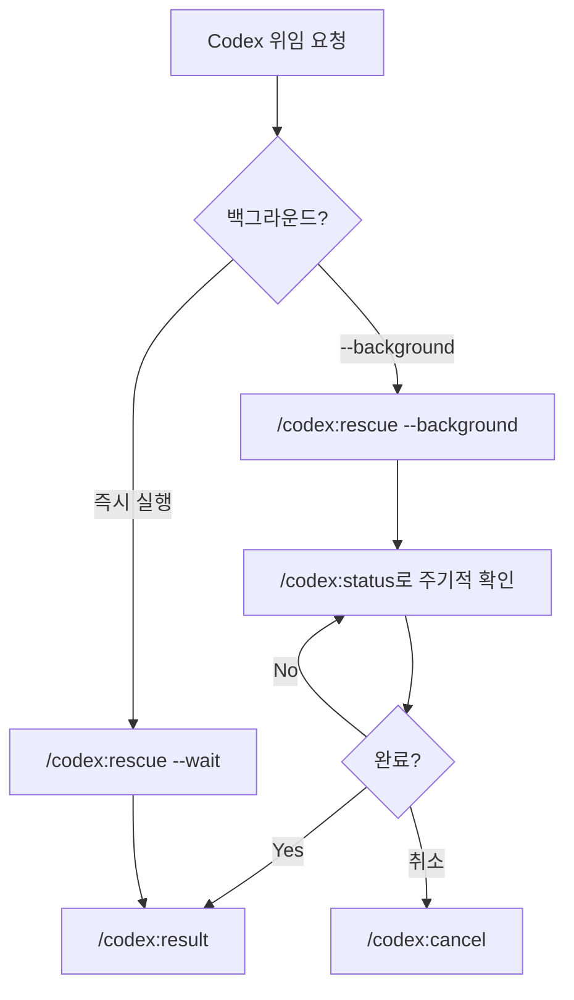

<!-- GENERATED BY build_obsidian_vaults.py -->
# Task delegation

[[codex-plugin Guide - MOC]]

> [!info]
> source: `categories/task-delegation.md`  
> role: `category`

## Why this note matters

이 문서는 Codex 플러그인의 작업 위임 기능을 상세히 다룹니다: /codex:rescue 명령어, codex-rescue 서브에이전트, 그리고 효과적인 위임 프롬프트 작성법.

## Source-adapted content

# 작업 위임

이 문서는 Codex 플러그인의 작업 위임 기능을 상세히 다룹니다: `/codex:rescue` 명령어, `codex-rescue` 서브에이전트, 그리고 효과적인 위임 프롬프트 작성법.

---

## 작업 위임 플로우



---

## `/codex:rescue`

조사, 수정, 후속 작업을 Codex에 위임합니다. 내부적으로 `codex-rescue` 서브에이전트를 경유하여 `codex-companion.mjs task`를 호출합니다.

### 문법

```bash
/codex:rescue [--background|--wait] [--resume|--fresh] [--model <model|spark>] [--effort <none|minimal|low|medium|high|xhigh>] [작업 설명]
```

### 옵션 상세

| 옵션 | 설명 | 기본값 |
|------|------|--------|
| `--background` | 비동기 백그라운드 실행 | -- |
| `--wait` | 동기 foreground 실행 | (기본 동작) |
| `--resume` | 이전 rescue thread를 이어서 작업 | -- |
| `--fresh` | 새 rescue thread를 강제 시작 | -- |
| `--model <name>` | 사용할 모델 지정 | Codex 기본값 또는 config.toml |
| `--effort <level>` | 추론 깊이 지정 | Codex 기본값 또는 config.toml |

### 모델 별칭

| 입력 | 실제 모델 |
|------|-----------|
| `spark` | `gpt-5.3-codex-spark` |
| `gpt-5.4-mini` | 그대로 전달 |
| (지정하지 않음) | Codex 기본값 또는 config.toml 설정 |

### Effort 수준 선택 가이드

| 수준 | 언제 사용하나 |
|------|--------------|
| `none` / `minimal` | 단순 형식 변환, 기계적인 수정 |
| `low` | 명확한 버그의 빠른 패치 |
| `medium` | 일반적인 조사 및 수정 작업 |
| `high` | 복잡한 버그 조사, 다단계 수정 |
| `xhigh` | 아키텍처 수준의 분석이 필요한 작업 |

> `--effort`를 지정하지 않으면 Codex가 자체 판단하거나 config.toml의 `model_reasoning_effort` 설정을 따릅니다.

### `--resume` vs `--fresh` 선택 기준

| 상황 | 선택 |
|------|------|
| "아까 조사한 내용 이어서 해줘" | `--resume` |
| "그 수정안 중 첫 번째를 적용해줘" | `--resume` |
| "다른 접근으로 다시 시도해줘" | `--fresh` |
| 완전히 새로운 작업 | `--fresh` 또는 미지정 |

둘 다 지정하지 않으면 이전 rescue thread가 있을 경우 계속할지 새로 시작할지 묻습니다.

### 실전 예시

```bash
# 기본 작업 위임
/codex:rescue 테스트가 실패하기 시작한 원인을 조사하고 수정 제안을 작성해줘

# 이전 작업 이어서 수행
/codex:rescue --resume 위의 수정안 중 첫 번째를 적용해줘

# 빠른 모델로 간단한 수정
/codex:rescue --model spark 타입 에러를 빠르게 수정해줘

# 고effort로 복잡한 조사
/codex:rescue --effort high --background 플레이키 테스트의 근본 원인을 분석해줘

# 특정 모델과 effort 조합
/codex:rescue --model gpt-5.4-mini --effort medium 통합 테스트 실패 원인 조사
```

### 팁

- `--model`과 `--effort`를 지정하지 않으면 Codex가 자체적으로 최적의 설정을 선택합니다
- 장시간 작업은 `--background`로 실행하여 Claude Code에서 다른 작업을 병행하세요
- 프롬프트를 제공하지 않으면 무엇을 조사/수정할지 묻습니다

---

## `codex-rescue` 서브에이전트

Claude Code의 에이전트 시스템에 등록된 서브에이전트로, `/agents`에서 확인할 수 있습니다.

### 자동 호출 조건

`codex-rescue` 에이전트는 다음 상황에서 Claude Code가 **자동으로** 호출할 수 있습니다:

- Claude Code가 디버깅이나 구현에서 막혔을 때
- 두 번째 구현/진단 패스가 필요할 때
- 더 깊은 근본 원인 조사가 필요할 때
- 대규모 코딩 작업을 Codex에 넘기는 것이 효율적일 때

> 단순한 작업은 Claude Code가 직접 처리합니다. 에이전트는 Claude Code만으로는 부족한 상황에서 자동 트리거됩니다.

### 수동 호출 방법

`/codex:rescue` 슬래시 명령어를 사용합니다. 이것이 사실상 `codex-rescue` 에이전트의 수동 인터페이스입니다.

또는 자연어로 위임을 요청할 수도 있습니다:

```text
Codex한테 데이터베이스 연결 로직을 더 탄력적으로 재설계해달라고 해줘
```

### 에이전트와 직접 명령어의 차이

| 관점 | `/codex:rescue` 명령어 | `codex-rescue` 에이전트 (자동) |
|------|------------------------|-------------------------------|
| **트리거** | 사용자가 직접 실행 | Claude Code가 자동 판단하여 호출 |
| **경로** | rescue.md → codex-rescue → codex-companion.mjs task | Claude Code → codex-rescue → codex-companion.mjs task |
| **최종 실행** | 동일 (codex-companion.mjs task) | 동일 |

---

## 효과적인 위임 프롬프트 작성법

Codex에 작업을 위임할 때 프롬프트의 품질이 결과의 품질을 결정합니다.

### 명확한 작업 범위 정의

좋은 프롬프트는 다음을 포함합니다:

1. **구체적인 문제/작업 설명**: 무엇을 해야 하는지
2. **관련 컨텍스트**: 어디에서 문제가 발생하는지, 어떤 파일이 관련되는지
3. **기대하는 결과**: 최종 상태가 어떠해야 하는지

```bash
# 나쁜 예 -- 너무 모호함
/codex:rescue 버그 수정해줘

# 좋은 예 -- 구체적인 범위와 기대 결과
/codex:rescue 회원가입 API에서 이메일 중복 체크가 실패하는 원인을 조사하고, 최소 변경으로 수정해줘

# 나쁜 예 -- 범위가 지나치게 넓음
/codex:rescue 전체 코드베이스를 리팩토링해줘

# 좋은 예 -- 구체적인 리팩토링 범위
/codex:rescue src/db/connection.ts의 연결 풀 로직에서 커넥션 누수 가능성을 제거하고 재시도 로직을 추가해줘
```

### gpt-5-4-prompting 스킬의 4개 핵심 블록

Codex 플러그인에는 `gpt-5-4-prompting` 스킬이 포함되어 있습니다. 이 스킬은 Codex 프롬프트를 구조화할 때 사용하는 4개 핵심 XML 블록을 제공합니다:

| 블록 | 역할 | 사용 시점 |
|------|------|-----------|
| `<task>` | 구체적인 작업 설명, 관련 컨텍스트, 기대 결과 | 거의 모든 프롬프트 |
| `<structured_output_contract>` | 응답 형식 제약 (JSON, 특정 구조 등) | 결과 형식이 중요할 때 |
| `<default_follow_through_policy>` | 루틴 질문 없이 합리적 판단으로 진행하도록 지시 | 자율 실행이 필요할 때 |
| `<verification_loop>` | 결과를 작업 요구사항과 대조 검증하도록 지시 | 정확성이 중요할 때 |

> 이 블록들은 `codex-rescue` 에이전트가 프롬프트를 다듬을 때 내부적으로 참고합니다. 사용자가 직접 XML 태그를 작성할 필요는 없습니다.

### 자주 하는 실수

| 실수 | 문제 | 개선 |
|------|------|------|
| "버그 수정해줘" | Codex가 무엇을 수정해야 할지 모름 | 증상, 관련 파일, 재현 조건을 명시 |
| "전체 코드를 개선해줘" | 범위가 무한대 | 구체적인 파일이나 모듈로 한정 |
| "빠르게 해줘" | effort 설정으로 해결할 문제 | `--effort low` 또는 `--model spark` 사용 |
| 이전 작업 맥락 생략 | Codex가 이전 조사를 모름 | `--resume`으로 이전 스레드 연결 |

---

## 작업 관리 명령어

`/codex:rescue`로 시작한 작업의 라이프사이클을 관리하는 3개 명령어입니다.

### `/codex:status`

실행 중이거나 완료된 Codex 작업의 상태를 확인합니다.

```bash
/codex:status                     # 현재 세션의 작업 목록
/codex:status task-abc123         # 특정 작업의 상세 상태
/codex:status --all               # 모든 작업 (완료 포함) 표시
/codex:status --wait              # 작업 완료까지 대기
/codex:status --timeout-ms 30000  # 최대 30초 대기
```

### `/codex:result`

완료된 작업의 최종 결과를 조회합니다.

```bash
/codex:result                     # 가장 최근 완료 작업의 결과
/codex:result task-abc123         # 특정 작업의 결과
```

결과에는 verdict, summary, findings, 파일 경로, 라인 번호, 에러 메시지, 그리고 Codex session ID가 포함됩니다. session ID로 `codex resume <session-id>`를 실행하면 Codex에서 직접 작업을 이어갈 수 있습니다.

### `/codex:cancel`

실행 중인 백그라운드 작업을 취소합니다.

```bash
/codex:cancel                     # 현재 실행 중인 작업 취소
/codex:cancel task-abc123         # 특정 작업 취소
```
